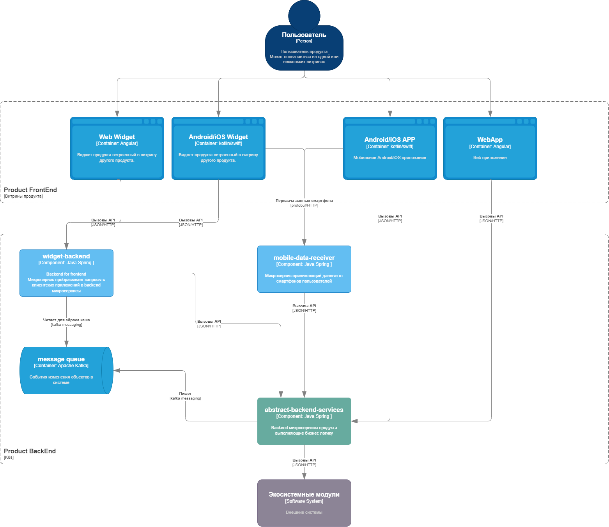
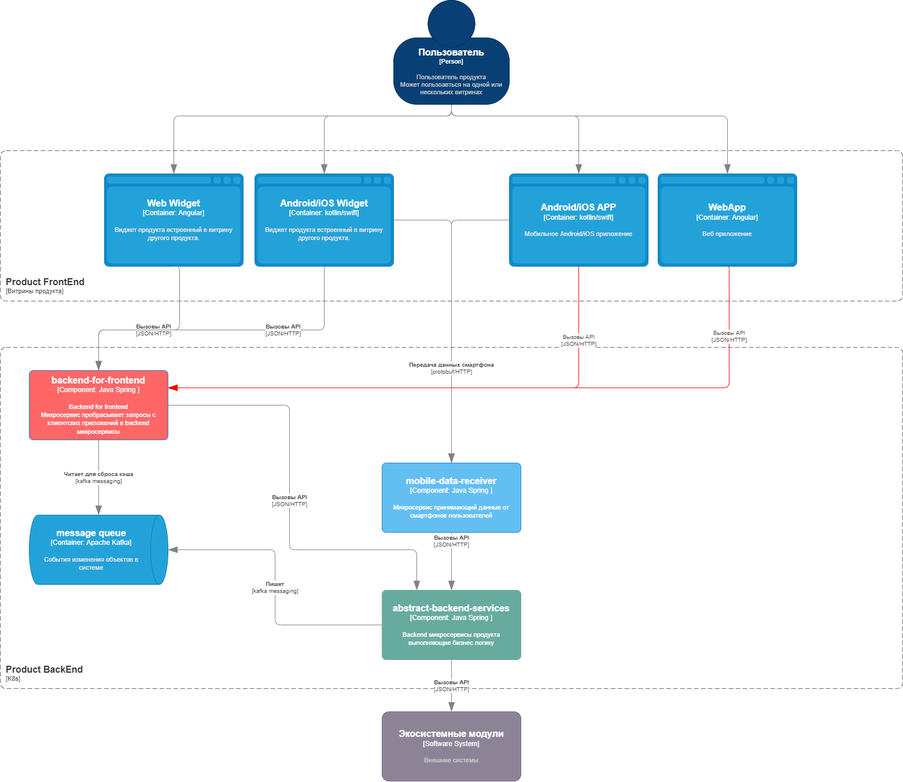
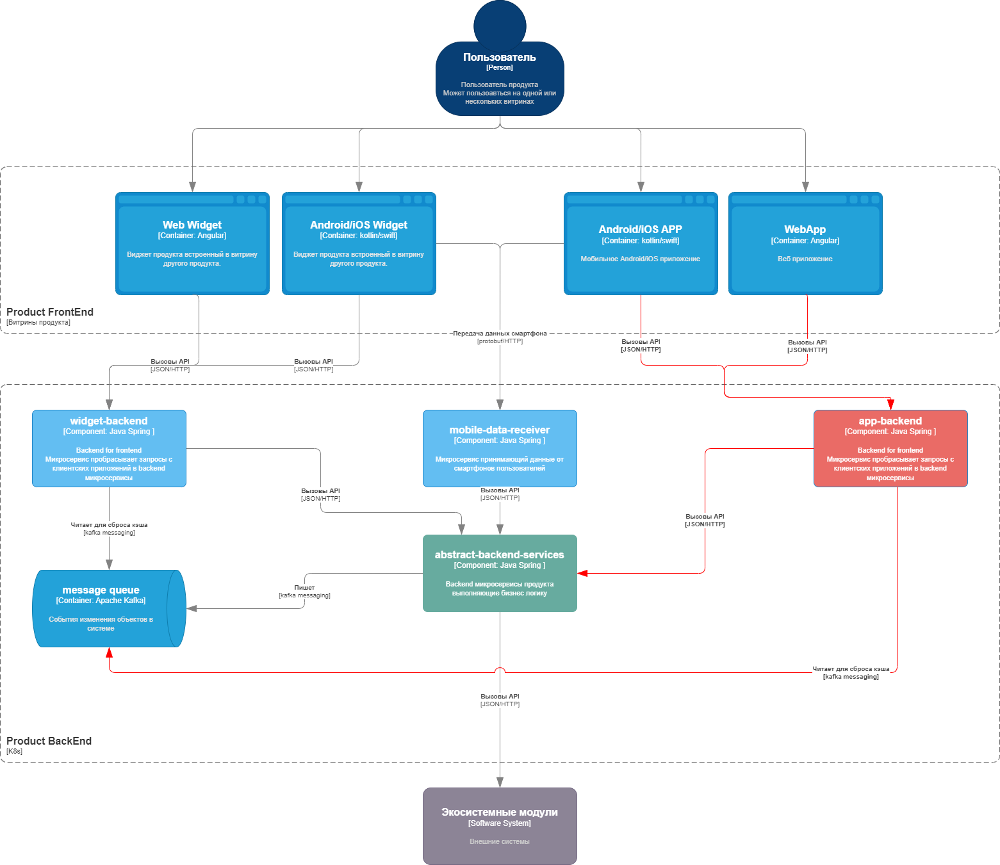

>Домашнее задание №1/4
# Выбор подхода к публикации API
## Бизнес контекст
B2C продукт существует в рамках экосистемы крупной компании.

Продукт предоставляет функции на собственных web/app витринах и на витринах продуктов экосистемы.

Собственные web/app приложения продукта обращаются к API сервисов напрямую.

Текущая система содержит более 80 микросервисов написанных разными разработчиками, какие-то сервисы соответствуют существующим стандартам качества, а какие-то являются legaсy. Контракты данных значительно отличаются от сервиса к сервису, что осложняет работу FrontEnd разработчиками.

Настроить мониторинг работы сервисов сложно из-за разных фремворков.

legaсy сервисы хочется переписать, т.к. их модификация сильно ограничена и требует большого количества ресурсов.

**Пользователи:** MAU 300.000+ 

**Дополнительный контекст**
* Недоступность продукта наносит финансовый и репутационный урон всей компании, так как продукт брендированный 
* Для основной целевой  аудитории продукт закрывает потребность в безопасности, по этому стабильность и качество работы основных функций важнее добавления новых фич
* Пользователи распространены по всей территории России, наибольшая часть сконцентрирована в ЦФО и ЮФО
* Обновление клиентского приложения сопровождается обязательными бюрократическими процессами 
* Сервис обладает потенциалом к росту, по этому система должна легко масштабироваться
* В экосистеме сервиса существует несколько способов авторизации пользователя. Модуль авторизации является экосистемным и постоянно модифицируется
* Продукт активно развивается в любой момент может появиться запрос на новую фичу

**Бизнес требования**
* Упростить процесс модификации системы
* Затраты на доработку должны быть небольшими, т.к. изменение подхода к API в ближайшей перспективе не принесут прибыль или новых пользователей
* Необходимо учитывать возможность проведения A/B тестов
* Ввод нового backend сервиса в промышленную эксплуатацию должен происходить легко. Желательно без необходимости изменений на Frontend, если сервис заменяет устаревший
### Бизнес-цели и бизнес-драйверы
* Сложно подойти к переписыванию legacy сервисов, т.к. их API напрямую запрашивается с клиента
* В legacy сервисы невозможно интегрировать новые методы пользовательской авторизации
* FrontEnd разработчикам неудобно разбираться в "зоопарке" API
* Проведение A/B тестов невозможно т.к. может повлиять на работу всех витрин продукта
### Бизнес-цель
Изменить подход к публикации API, чтобы система была легко модифицируема и могла масштабироваться под растущее количество пользователей.

## Стейкхолдеры

Стейкхолдер | Роль | Потребность
:---: | :---: | :---:
Пользователь|Пользуется продуктом Приносит прибыль| Чтобы старые функции работали также или лучше и чтобы появлялись новые функции
Менеджер продукта| Отвечает за бизнес показали и развитие продукта|Минимум ресурсов затрачивать на инфраструктурные задачи и максимально сфокусироваться на продуктовой разработке
BackEnd разработчики| Разрабатывают серверную часть продукта| Поменьше трогать легаси код. Работать с удобными фреймворками
FrontEnd разработчики| Разрабатывают клиентскую часть продукта|Использовать в разработке удобные API интерфейсы с понятными контрактами данных
Экосистемные модули| Обязательные к интеграции в продукт функции| Продукт должен встраивать новые функции быстро и с минимальными затратами ресурсов

## Пользовательские истории
**UC-1: Внедрение нового алгоритма**
* Разработчик создал новый алгоритм обработки данных
* Тестирование алгоритма на тестовом стенде
* Оформление заявки на обновление прод стенда
* Раскатка обновления на всех пользователей

**UC-2: Настройка мониторинга**
* Для продуктовой фичи был создан новый микросервис
* Настроить мониторинг API методов, используемых в этом микросервисе

**UC-3: Замена устаревшего сервиса**
* Разработчики переписал устаревший сервис
* Тестирование
* Выкатка на прод стенд 
* Настройка мониторинга
* Переключение запросов с витрин продукта на новый сервис

**UC-3: Внесение изменений в механизм авторизации пользователя**
* Экосистемный модуль доработал механизм авторизации пользователя
* Backend поддерживает изменения

**UC-4: Получение данных с устройства пользователя**
* Сервис принимает данные со смартфона пользователя по API
* Данные преобразуются и сохраняются на backend 
* Преобразованные данные отдаются пользователям по API

**UC-5 Выдача данных пользователю** 
* Пользователь открывает приложение 
* FrontEnd запрашивает данные для пользователя на BackEnd
* BackEnd проверяет авторизацию пользователя, подготавливает набор данных и отдаёт
## Атрибуты качества
* Запрос с пользовательского приложения должен выполняться менее чем за 3 секунды
* Обновление BackEnd сервисов должно происходить незаметно для пользователей 
* Наиболее нагруженные методы, используемые в виджетах, должны выдерживать 2000RPS
* Основная пользовательская база использует мобильное приложение, доступность приложения является наиболее важной
* Сервис получения данных от смартфонов пользователей высоконагруженный, потеря данные оказывает влияние на основную функциональность продукта
## Текущая архитектура

## Критичные сценарии и критичные характеристики
**Критичные сценарии:**
* Пользователи просматривают контент в мобильно/web приложении 
* Пользователи просматривают контент в виджетах экосистемных продуктов
* Смартфоны пользователей отправляют данные на Backend продукта 
* Команда разработки выполняет обновление/замену сервисов на backend 

**Критичные характеристики:**
* Продукт должен обладать высокой доступностью SLA 99.9%
* Наиболее нагруженные API методы должны выдерживать 2000 RPS
* Доработки инфрастуктуры для внедрения новой фичи должны занимать минимальное время
* Время выполнения запросов должно быть минимальным
* Стоимость разработки решения
* Время разработки решения
## ADR 
### Архитектурное решение 1. Оставить текущую архитектуру 
**Преимущества:**
* Затраты на разработку решения отсутствуют
* Время выполнения запроса зависит от одного сервиса
* Для наиболее важных витрин (собственных приложений) нет дополнительной точки отказа в виде прокси
* Нет дополнительных затрат на создание/доработку API метода в прокси сервисе

**Недостатки:**
* Для замены устаревших сервисов необходимо выполнять релиз web/app приложений
* Все сервисы имеют функционал проверки авторизации пользователя, проверка происходит при каждом запросе 
* Разработчики вынуждены поддерживать legacy сервисы, т.к. их замена сопряжена с рисками и затратами
* Обширный мониторинг необходимо настраивать на всех сервисах, т.к. пользовательские приложения напрямую к ним обращаются
* Контракты данных могут отличаться от сервиса к сервису

### Архитектурное решение 2. Общий прокси сервис под все витрины продута

**Преимущества**
* За прокси сервисом можно выполнять замену сервиса без влияния на FrontEnd, что должно сократить время разработки новых фич на BackEnd 
* Проверку авторизации может выполнять только прокси сервис, сервисы за прокси доверяют выполненной проверке
* Основной мониторинг настраивается только на прокси сервисе
* В критических случаях есть возможность внести логику в прокси сервис
* API имеет понятные контракты данных и семантику для FrontEnd разработчиков
* В перспективе даёт ускорение разработки новых фич, т.к. есть возможность переписать legacy сервисы и меньше беспокоиться об обратной совместимости

**Недостатки**
* Затраты ресурсов на создание/доработку API метода в прокси сервисе N+1
* К времени выполнения запроса прибавляется время на проксирование
* Прокси сервис является единой точкой отказа для всех витрин
* Наиболее нагруженные витрины влияют на работоспособность менее нагруженных, при разном влиянии на бизнес

### Архитектурное решение 3. Выделенный прокси сервис для витрин

**Преимущества**
* За прокси сервисом можно выполнять замену сервиса без влияния на FrontEnd, что должно сократить время разработки новых фич на BackEnd 
* Проверку авторизации может выполнять только прокси сервис, сервисы за прокси доверяют выполненной проверке
  * Для разных витрин может поддерживаться разная авторизация
* Основной мониторинг настраивается только на прокси сервисах
* В критических случаях есть возможность внести логику в прокси сервис
* API имеет понятные контракты данных и семантику для FrontEnd разработчиков
* Есть возможность отключить нагрузку от наименее важных витрин для восстановления работоспособности наиболее важных

**Недостатки**
* Затраты ресурсов на создание/доработку API метода в прокси сервисе N+количество категорий витрин
* К времени выполнения запроса прибавляется время на проксирование
* Прокси сервис является единой точкой отказа одной категории витрин
* Дополнительные затраты на настройку мониторинга в сравнении с единым прокси сервисом

### Решение 

### Последствия решения 
**Положительные**

**Негативные**
