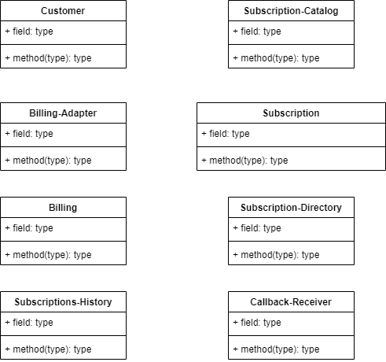
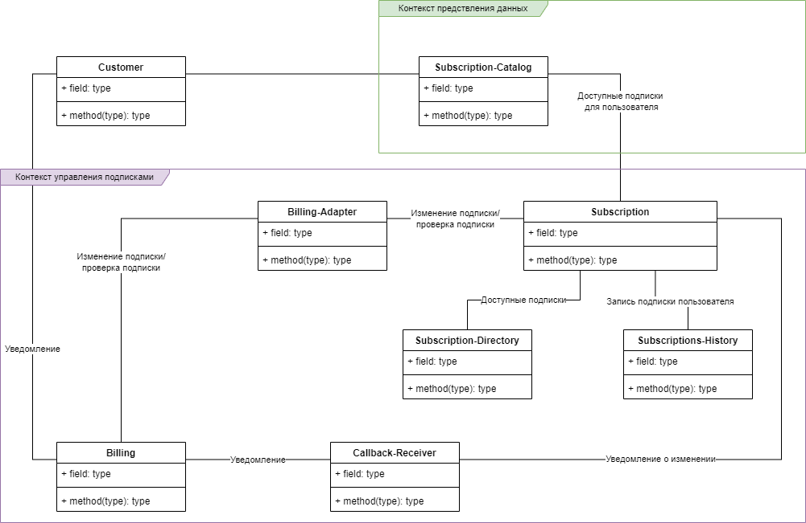
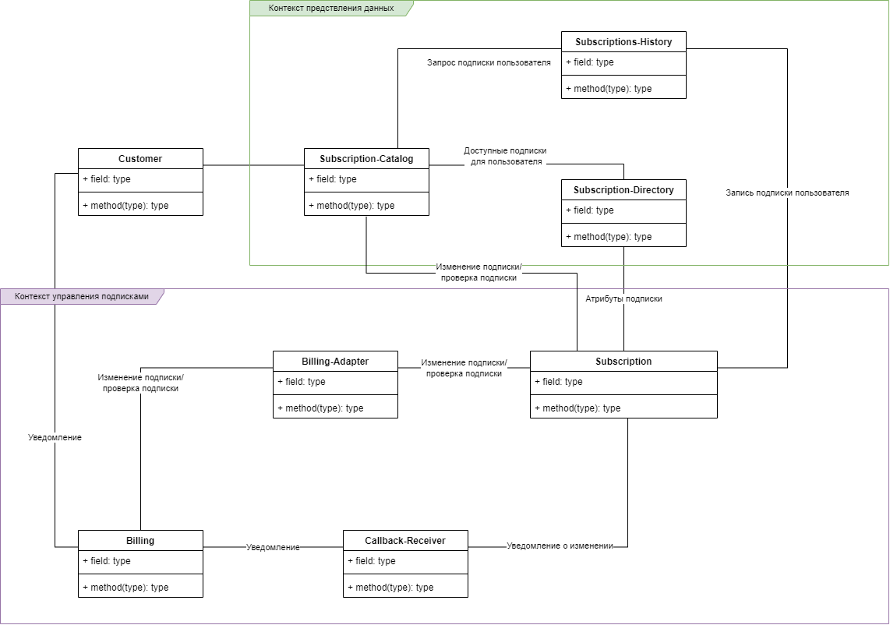
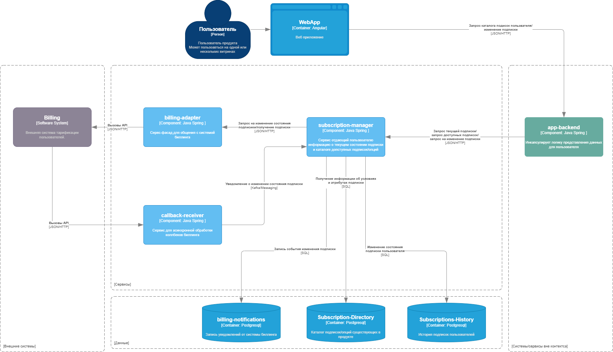

# Декомпозиция на функциональные компоненты
## Бизнес контекст
Для системы из [HW1](./Software_Architect/HW1/HomeWork1.md) разрабатывается архитектура домена управления подписками. 
Для мультиплатформенного сервиса необходимо разработать систему управления подписками пользователя. 

**Первоначальный список требований:**
1. Пользователь может подключать/отключать/переключать подписку.
2. Система должная поддерживать градацию подписок. 
3. У пользователя может быть одна основная и несколько дополнительных подписок. 
4. Пользователь может выбрать подходящую подписку из предложенного каталога.
5. В зависимости от типа пользователя каталог предложенных подписок может отличаться.
6. Пользователь может видеть свою активную подписку и её условия.
7. В компании существует несколько систем биллинга, возможно в будущем придётся менять систему. 
## Сущности предметной области
* Customer - Пользователь. Объект другой доменной области.
* Subscription - Подписка. Ключевой объект домена. Сущность предоставляющая определённому пользователю возможность доступа к системе с определённым уровнем.
* Subscription-Catalog - Каталог подписок. В каталоге отображаются доступные для подключения подписки и подключенная подписка, при наличии.
* Subscription-Directory - Справочник подписок существующих в продукте и константы их условий.
* Subscriptions-History - История подписок пользователя. Записывает и обновляет данные о предыдущих и текущей подписке пользователя.
* Billing - Внешняя система тарификации пользователей.
* Billing-Adapter - Адаптер для общения с системой биллинга.
* Callback-Receiver - Приёмник для уведомлений о состояния подписок в биллинге.
  

## Функциональная декомпозиция

### 1. Вариант декомпозиции
Вывести формирование каталога в область представления пользовательских данных. И сконцентрировать всю логику касающуюся подписок в одном блоке (Subscription).

### 2. Вариант декомпозиции
Разделить ответственность отображения информации о подписках и ответственность за изменение подписки.

## Сценарии изменений
1. Подключение новой системы биллинга (например AppStore для покупок на ios) 
    - (высокая вероятность)
2. Изменение контракта данных с системой биллинга 
    - (низкая вероятность)
3. Замена системы биллинга на новое корпоративное решение 
    - (средняя вероятность)
4. Добавление нового варианта подписки 
    - (высокая вероятность)
5. Добавление вариантов подписок, которые не нужно записывать в систему биллинга
    - (низкая вероятность)

### Оценка сценария изменения 1 для решений декомпозиции
>Подключение новой системы биллинга (например AppStore для покупок на ios)
* Вариант декомпозиции 1. Доработки в Subscription, Subscription-Directory, Billing-Adapter, Callback-Receiver. В контексте управления подписками.
* Вариант декомпозиции 2. Доработки в Subscription, Subscription-Directory, Billing-Adapter, Callback-Receiver. В контексте управления подписками и контексте представления данных.

### Оценка сценария изменения 2 для решений декомпозиции
>Изменение контракта данных с системой биллинга 
* Вариант  декомпозиции 1. Доработки в Billing-Adapter, Callback-Receiver.
* Вариант  декомпозиции 2. Доработки в Billing-Adapter,Callback-Receiver.

### Оценка сценария изменения 2 для решений декомпозиции
>Замена системы биллинга на новое корпоративное решение 
* Вариант  декомпозиции 1. Доработки в Billing-Adapter, Callback-Receiver, Subscription-Directory. В контексте управления подписками.
* Вариант  декомпозиции 2. Доработки в Billing-Adapter, Callback-Receiver, Subscription-Directory. В контексте управления подписками и контексте представления данных.

### Оценка сценария изменения 2 для решений декомпозиции
>Добавление нового варианта подписки 
* Вариант  декомпозиции 1. Доработки в Subscription-Directory. В контексте управления подписками.
* Вариант  декомпозиции 2. Доработки в Subscription-Directory, Subscription. В контексте управления подписками и контексте представления данных.

### Оценка сценария изменения 2 для решений декомпозиции
>Добавление вариантов подписок, которые не нужно записывать в систему биллинга
* Вариант декомпозиции 1. Доработки в Subscription, Subscription-Directory. В контексте управления подписками.
* Вариант декомпозиции 2. Доработки в Subscription-Catalog, Subscription, Subscription-Directory. В контексте управления подписками и контексте представления данных.

## Сравнительный анализ
С точки зрения модифицируемости вариант декомпозиции 1 показался лучше. Т.к. всегда изменения приходятся на один контекст. Логика управления подписок не протекает в область представления данных.
Но вариант стоит дополнительно оценить с точки зрения отказоустойчивости.

# Контекстаная диаграмма итоговой системы подписок
