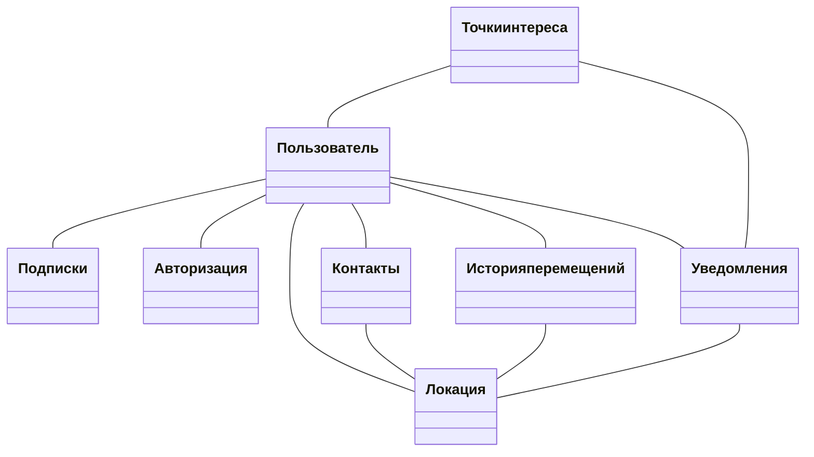
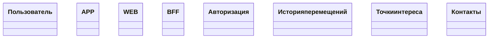
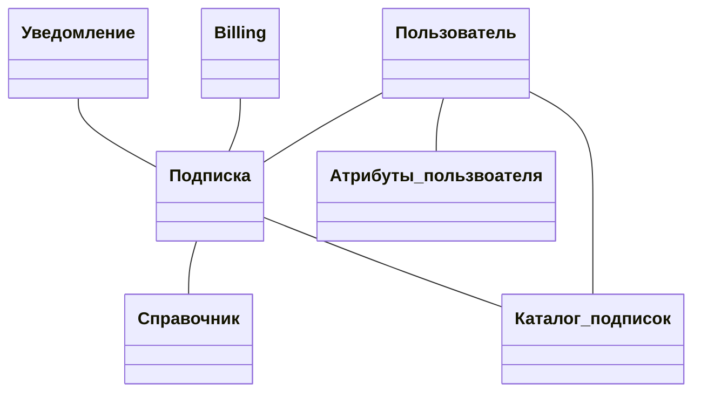

# Декомпозиция на функциональные компоненты
## Модель предметной области

```mermaid
classDiagram
Пользователь--Локация
Пользователь--Подписки
Пользователь--Авторизация
Пользователь--Уведомления
Пользователь--История перемещений
Точки интереса--Пользователь
Точки интереса--Уведомления
Пользователь--Контакты
Контакты--Локация
История перемещений--Локация
Уведомления--Локация


class Локация{
    }

class Пользователь{
    }

class Подписки{
    }

class Уведомления{
    }

class Авторизация{
    }

class История перемещений{
    }

class Точки интереса{

    }

class Контакты{
    }
```
## Модель предметной области 2

```mermaid
classDiagram

class Пользователь{
    }

class APP{
    }

class WEB{
    }

class BFF{
    }

class Авторизация{
    }

class История перемещений{
    }

class Точки интереса{

    }

class Контакты{
    }
```
## Модель предметной области 3

```mermaid
classDiagram
Пользователь--Подписка
Подписка --Справочник
Уведомление--Подписка
Каталог_подписок--Пользователь
Пользователь--Атрибуты_пользвоателя
Billing--Подписка
Подписка--Каталог_подписок
class Подписка{
    }

class Справочник{
    }

class Уведомление{
    }

class Billing{
    }

class Пользователь{
    }

class Каталог_подписок{
    }

class Атрибуты_пользвоателя{

    }
```

## Сценарии изменений
