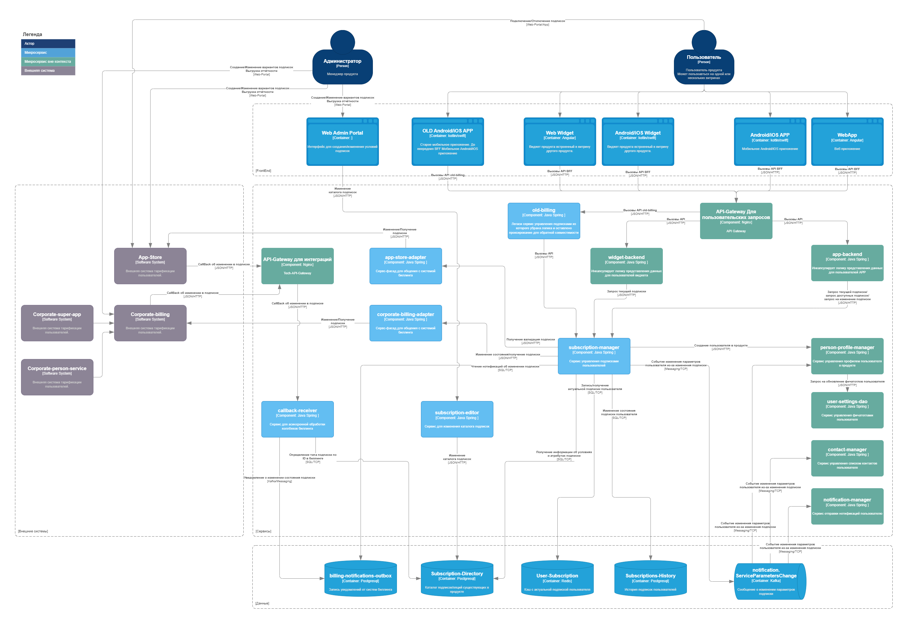

# [OTUS Project] Проектирование системы подписок в продукте<!-- omit from toc --> 

- [Описание проблемы](#описание-проблемы)
  - [Контекст](#контекст)
  - [Бизнес цели](#бизнес-цели)
  - [Архитектурные драйверы](#архитектурные-драйверы)
- [Описание требований](#описание-требований)
  - [Стейкхолдеры](#стейкхолдеры)
  - [Пользовательские сценарии](#пользовательские-сценарии)
  - [Сценарии для атрибутов качества](#сценарии-для-атрибутов-качества)
  - [Ограничения](#ограничения)
  - [Предположения](#предположения)
- [Описание решения](#описание-решения)
  - [Диаграмма контекста](#диаграмма-контекста)
  - [Диаграмма контейнеров](#диаграмма-контейнеров)
  - [Основные архитектурные компоненты](#основные-архитектурные-компоненты)
  - [Сценарии модификации](#сценарии-модификации)
    - [Добавление/замена внешней биллинговой системы](#добавлениезамена-внешней-биллинговой-системы)
    - [Добавление новой подписки/опции](#добавление-новой-подпискиопции)
  - [Масштабируемость и производительность](#масштабируемость-и-производительность)
  - [Обратная совместимость](#обратная-совместимость)
  - [Безопасность](#безопасность)
  - [Диаграмма развёртывания](#диаграмма-развёртывания)
  - [Диаграмма последовательности для пользовательских сценариев](#диаграмма-последовательности-для-пользовательских-сценариев)

# Описание проблемы

## Контекст 
B2C продукт существует в рамках экосистемы крупной компании.

Продукт предоставляет функции на собственных web/app витринах и на витринах продуктов экосистемы.

Архитектура: 
* Микросервисы Java
* Kafka
* Postgresql
* Redis

Пользователи: MAU 300.000+ 

**Дополнительный контекст**
* Недоступность продукта наносит финансовый и репутационный урон всей компании, так как продукт брендированный 
* Для основной целевой  аудитории продукт закрывает потребность в безопасности, по этому стабильность и качество работы основных функций важнее добавления новых фич
* Пользователи распространены по всей территории России, наибольшая часть сконцентрирована в ЦФО и ЮФО
* Обновление клиентского приложения сопровождается обязательными бюрократическими процессами 
* Сервис обладает потенциалом к росту, по этому система должна легко масштабироваться
* Продукт активно развивается в любой момент может появиться запрос на новый вариант монетизации.

## Бизнес цели

* Интегрироваться с биллинговыми системами
* Подключение новой биллинговой системы должно выполняться с минимальными затратами ресурсов
* Добавление новой подписки/опции должно выполняться с минимальными затратами ресурсов

## Архитектурные драйверы

* Продукт интегрирован не со всеми необходимыми биллинговыми системами 
* Продукт содержит сложную логику переключения подписок на своей стороне, внесение модификаций в которую требует большого количества ресурсов
* Компания теряет деньги за счёт сложности заведения новых вариантов подписок и дополнительных промо опций.

# Описание требований

## Стейкхолдеры

Стейкхолдер | Роль | Потребность
:---: | :---: | :---:
Пользователь|Пользуется продуктом Приносит прибыль| Оплачивать функции продукта удобным способом
Менеджер продукта| Отвечает за бизнес показали и развитие продукта|Минимум ресурсов затрачивать на инфраструктурные задачи и максимально сфокусироваться на продуктовой разработке. Вводить новые варианты подписок, проводить акции и эксперименты
BackEnd разработчики| Разрабатывают серверную часть продукта| Писать решения, которые долгое время не нужно рефакторить
FrontEnd разработчики| Разрабатывают клиентскую часть продукта|Писать меньше логики на FE
Billing| Системы тарификации пользователей| Встраиваться в продукт, тарифицировать пользователей

## Пользовательские сценарии

* **US-1** Подключение/отключение подписки пользователем
  * Пользователь меняет состояние подписки на одной из витрин
  * Продукт получает и применяет новое состояние подписки
* **US-2** Блокировка/Разблокировка функций приложения
  * Система биллинга уведомляет продукт о необходимости блокировки/разблокировки функций для пользователя
  * Продукт блокирует/разблокирует функции для пользователя
* **US-3** Обработка нотификаций об изменениях состояния подписки
  * Подписка меняет своё состояние в биллинговой системе по системным причинам (неоплата/закрытие пользователя/т.д.)
  * Продукт обрабатывает изменение состояния подписки
* **US-4** Создание новой подписки
  * Менеджер продукта заводит новую подписку с изменёнными условиями использования продукта
  * Продукт отображает новую подписку для пользователя в каталоге услуг
* **US-5** Активация промокода 
  * Биллинговая система предоставляет возможность активации промокодов для подписок 
  * Продукт предоставляет интерфейс для введения промокодов
  * Пользователь вводит промокод 
  * Биллинговая система изменяет условия использования подписки на время действия промокода 
  * Продукт отображает активированный промокод в интерфейсе
* **US-6** Тарификация подписки
  * Биллинговая система тарифицирует пользователя и уведомляет продукт
  * Продукт отображает оплаченный период для пользователя

## Сценарии для атрибутов качества

* Доступность (US-1,US-4)
  * Подключение подписки должно быть доступно пользователю максимально возможное количество времени, т.к. количество подписчиков напрямую влияет на выручку SLA 99.9%
* Масштабируемость (US-1,US-4,US-3)
  * Продукт обладает высоким потенциалом к росту пользовательской базы. Необходимо учитывать возможность повышения нагрузки
  * Продукт имеет тенденцию к сезонному увеличению активности пользователей
* Надёжность (US-1,US-2,US-3,US-4,...)
  * Оплата подписки является важной операцией для пользователя. Пользователь обязательно проверит, что функции, которые он оплатил доступны.
* Безопасность
  * Данные оплаты нельзя передавать в зоне интернет и в незашифрованном виде
* Производительность (US-3)
  * Изменение состояния подписки должно обрабатываться за минимальное время, чтобы предоставить пользователю оплаченные функции и оправдать его доверие

## Ограничения 
* Уже существует множество версий мобильного приложения, которое обращается к старому API подписок, необходимо поддержать обратную совместимость.
* Системы биллинга внутри экосистемы меняются достаточно часто, необходимо предусмотреть возможность замены биллинга / изменения контракта данных

## Предположения 
* Биллинговые системы являются mission-critical системами, обладают малым количеством ошибок и высокой надёжностью

# Описание решения
[Архитектурные решения](./ADRs)

## Диаграмма контекста

## Диаграмма контейнеров

## Основные архитектурные компоненты
* **Внешние системы биллинга:**
  * **App-Store** - Система управления подписками Apple 
  * **Corporate-billing** - Система управления подписками внутри экосистемы
* **Сервисы контекста управления подписками:**
  * **subscription-manager** - Выполняет бизнес логику управления подписками. Единая точка изменения состояния подписок в системе. Предоставляет API для управления подписками. 
  * **old-billing** - Легаси сервис управления подписками, к которому обращаются устаревшие версии APP 
  * **app-store-adapter** - Фасад для API App-Store. Приводит терминологию App-Store к внутренней терминологии контекста и проксирует запросы. 
  * **corporate-billing-adapter** - Фасад для API корпоративного биллинга. Приводит терминологию корпоративного биллинга к внутренней терминологии контекста и проксирует запросы. 
  * **callback-receiver** - Принимает коллбеки от внешних биллинговых систем. Приводит коллбеки к виду уведомлений об изменении состояния подписки во внутренней терминологии контекста. И сохраняет в outbox. 
  * **subscription-editor** - Сервис реализует API для управления справочником подписок Subscription-Directory.
* **Хранилища данных и MQ контекста управления подписками:**
  * **billing-notifications-outbox** - Outbox для нотификаций об изменении состояния подписки.
  * **Subscription-Directory** - Справочник подписок, существующих в системе.
  * **User-Subscription** - Кеш, хранящий актуальную подписку пользователя, для быстрой передачи на FrontEnd или в другие контексты.
  * **Subscriptions-History** - Хранилище исторических данных о подписках пользователей. Используется для отображения на FrontEnd и запросов технической поддержки.
  * **notification.ServiceParametersChange** - Очередь сообщений, информирующая все "заинтересованные" сервисы об изменении состояния подписки пользователя.
* **Сервисы вне контекста подписок:**
  * **API-Gateway Для пользовательских запросов** - Прокси для запросов от FrontEnd. 
  * **API-Gateway для интеграций** - Прокси для интеграции с внешними системами.
  * **widget-backend** - BFF для витрины виджета. Инкапсулирует логику представления данных для пользователей виджета.
  * **app-backend** - BFF для витрины APP. Инкапсулирует логику представления данных для пользователей APP.
  * **person-profile-manager** - Сервис управления профилем пользователя в продукте. Читает сообщения об изменении состояния подписки, и применяет изменения к профилю.
  * **user-settings-dao** - Сервис управления фичатоглами пользователя. Читает сообщения об изменении состояния подписки, и включает/выключает фичатоглы для пользователя.
  * **contact-manager** - Сервис управления списком контактов пользователя. Читает сообщения об изменении состояния подписки, и изменяет состояние контактов пользователя.
  * **notification-manager** - Сервис отправки нотификаций пользователю. Читает сообщения об изменении состояния подписки, и отправляет пользователю уведомления об изменении состояния подписки.

## Сценарии модификации
### Добавление/замена внешней биллинговой системы
Необходимые изменения: 
* Создать адаптер в контуре системы для общения с внешней системой
* Доработать callback-receiver для обработки коллбеков от новой системы
* Доработать subscription-manager для обработки запросов на обращение в новую биллинговую систему
* Обеспечить сетевые доступы
* Настроить подписки во внешней биллинговой системе
* Добавить в справочник подписок Subscription-Directory подписки из новой системы

### Добавление новой подписки/опции
Необходимые изменения: 
* Создать подписку/опцию во внешней биллинговой системе
* Добавить подписку/опцию в справочник подписок Subscription-Directory

Обработка подключения/изменения/отключения новой подписки/опции будет происходить по аналогии с существующими подписками/опциями. Дополнительных изменений в логике не требуется. 

## Масштабируемость и производительность
При выявлении проблем с производительностью, таких как: 
* Увеличение количества открытых запросов
* Рост времени обработки запроса
* Постоянный рост объёма данных
* Увеличение вычислительной сложности
* Увеличение нагрузки на БД

Необходимо выполнить масштабирование системы: 
* Увеличить количество реплик микросервисов средствами K8s
* Увеличить количество партиций топиков Kafka в соответствии с количеством реплик сервисов 
* Произвести партиционирование таблиц БД: 
  * Subscriptions-History партиционировать по hash от идентификатора пользователя, т.к. поиск всегда производится для конкретного пользователя и это сократит объём сканируемой таблицы. 
  * billing-notifications-outbox партиционировать по дате получения нотификации и настроить удаление неактуальных партиций.

## Обратная совместимость
* Для поддержки обратной совместимости с устаревшими версиями мобильных приложений пользователей доработан сервис old-billing:
  * Логика управления подписками исключена из сервиса 
  * Добавлено проксирование запросов в новый сервис subscription-manager

* Для будущих доработок необходимо использовать в сервисах BFF версионивароение major-version вида: `service/api-major-version/api-method`

## Безопасность
* Чувствительные пользовательские данные передаются только в body POST запросов.
* Для авторизации пользователя при запросах используется bearer токен Auth2.0 
  * Валидность токена проверяется при каждом запросе в BFF с помощью обращения в сервис контекста авторизации.
* Для аутентификации внешних систем используется API-key.

## Диаграмма развёртывания 

## Диаграмма последовательности для пользовательских сценариев