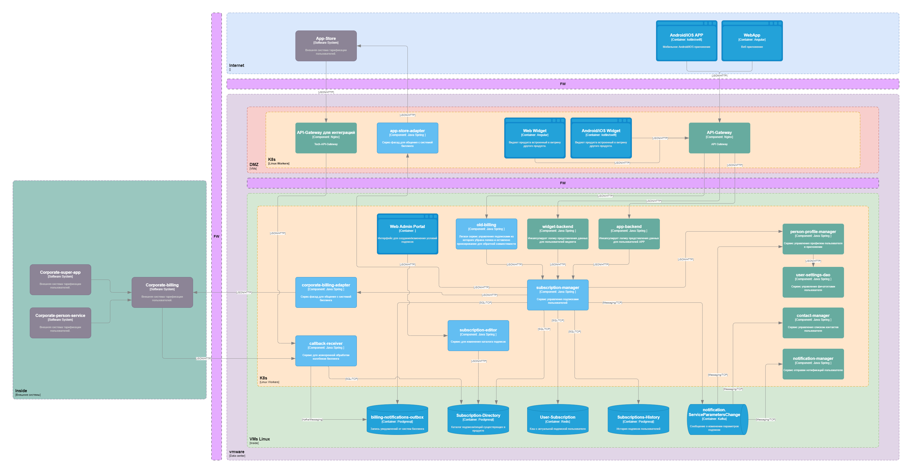

# [OTUS Project] Проектирование системы подписок в продукте<!-- omit from toc --> 

- [Описание проблемы](#описание-проблемы)
  - [Контекст](#контекст)
  - [Бизнес цели](#бизнес-цели)
  - [Архитектурные драйверы](#архитектурные-драйверы)
- [Описание требований](#описание-требований)
  - [Стейкхолдеры](#стейкхолдеры)
  - [Пользовательские сценарии](#пользовательские-сценарии)
  - [Сценарии для атрибутов качества](#сценарии-для-атрибутов-качества)
  - [Ограничения](#ограничения)
  - [Предположения](#предположения)
- [Описание решения](#описание-решения)
  - [Контекстная диаграмма](#контекстная-диаграмма)
  - [Диаграмма контейнеров](#диаграмма-контейнеров)
  - [Диаграмма развёртывания](#диаграмма-развёртывания)
  - [Диаграмма последовательности для пользовательских сценариев](#диаграмма-последовательности-для-пользовательских-сценариев)

# Описание проблемы

## Контекст 
B2C продукт существует в рамках экосистемы крупной компании.

Продукт предоставляет функции на собственных web/app витринах и на витринах продуктов экосистемы.

**Пользователи:** MAU 300.000+ 

**Дополнительный контекст**
* Недоступность продукта наносит финансовый и репутационный урон всей компании, так как продукт брендированный 
* Для основной целевой  аудитории продукт закрывает потребность в безопасности, по этому стабильность и качество работы основных функций важнее добавления новых фич
* Пользователи распространены по всей территории России, наибольшая часть сконцентрирована в ЦФО и ЮФО
* Обновление клиентского приложения сопровождается обязательными бюрократическими процессами 
* Сервис обладает потенциалом к росту, по этому система должна легко масштабироваться
* Продукт активно развивается в любой момент может появиться запрос на новый вариант монетизации.

## Бизнес цели

* Интегрироваться с биллинговыми системамим 
* Подключение новой биллингой системы должно выполняться с минимальными затратами ресурсов
* Добелвение новой подписки/опции должно выполняться с минимальными затратами ресурсов

## Архитектурные драйверы

* Продукт интегрировать не со всеми необходимыми биллинговыми системами 
* Продукт содержит сложную логику переключения подписок на своей стороне, внесение модификаций в которую требует большого количества ресурсов
* Компания теряет деньги за счёт сложности заведения новых вариантов подписок и дополнительных промо опций.

# Описание требований

## Стейкхолдеры

Стейкхолдер | Роль | Потребность
:---: | :---: | :---:
Пользователь|Пользуется продуктом Приносит прибыль| Оплачивать функции продукта удобным способом
Менеджер продукта| Отвечает за бизнес показали и развитие продукта|Минимум ресурсов затрачивать на инфраструктурные задачи и максимально сфокусироваться на продуктовой разработке. Вводить новые варианты подписок, проводить акции и эксперименты
BackEnd разработчики| Разрабатывают серверную часть продукта| Писать решения, которые долгое время не нужно рефакторить
FrontEnd разработчики| Разрабатывают клиентскую часть продукта|Писать меньше логики на FE
Billing| Системы тарификации пользователей| Встраиваться в продукт, тарифицировать пользователей

## Пользовательские сценарии

* **US-1** Подключение/отключение подписки пользователем
  * Пользователь меняет состояние подписки на одной из витрин
  * Продукт получает и применяет новое состояние подписки
* **US-2** Блокировка/Разблокировка функций приложения
  * Система биллинга уведомляет продукт о необходимости блокировки/разблокировки функций для пользоватя
  * Продукт блокирует/разблокирует функции для пользователя
* **US-3** Обработка нотификаций о изменениях состояния подписки
  * ПОдписка меняет своё состояние в биллинговой сиситеме по системным причинам (неоплата/закрытие пользователя/т.д.)
  * Продукт обрабатывает изменение состояния подписки
* **US-4** Создание новой подписки
  * Менеджер продукта заводит новую подписку с изменёнными условиями использоваения продукта
  * Продукт отображает новую подписку для пользователя в каталоге услуг
* **US-5** Активация промокода 
  * Биллинговая система предоставляет возможность активации промокодов для подписок 
  * Продукт предоставляет интерфейс для введения промокодов
  * Пользователь вводит промокод 
  * Биллинговая система изменяет условия использования подписки на время действия промокода 
  * Продукт отображает активированный промокод в интерфейсе
* **US-6** Тарификация подписки
  * Биллинговая система тарифицирует пользователя и уведомляет продукт
  * Продукт отображает оплаченный период для пользователя

## Сценарии для атрибутов качества

* Доступность (US-1,US-4)
  * Подключение подписки должно быть доступно пользователю максимально возможное количетсво времени, т.к. количество подписчиков напрямую влияет на выручку SLA 99.9%
* Масштабируемость (US-1,US-4,US-3)
  * Продукт обладает высоким потенциалом к роксту пользовательской базы. Необходимо учитывать возможность повышения нагрузки
  * Продукт имеет тенденцию к сезонному увеличению активности пользователей
* Надёжность (US-1,US-2,US-3,US-4,...)
  * Оплата подписки является важной операцией для пользователя. Пользователь обязательно проверит, что функции, которые он оплатил доступны.
* Безопасность
  * Данные оплаты нельзя передвать в зоне интернет и в незашифрованном виде
* Производительность (US-3)
  * Изменение состояния подписки должно обрабатываться за минимальное время, чтобы предоставить пользователю оплаченные функции и оправдать его доверие

## Ограничения 
* Уже существует множество версий мобильного приложения, которое обращается к старому API подписок, необходимо поддержать обратную совместимость.
* Системы биллинга внутри экосистемы меняются достаточно часто, необходимос предусмотреть возможность замены биллинга / изменения контракта данных

## Предположения 
* Биллинговые системы являются mission-critical системами, обладают небольшим количеством ошибок и высокой надёжностью

# Описание решения

## Контекстная диаграмма

## Диаграмма контейнеров

## Диаграмма развёртывания 

## Диаграмма последовательности для пользовательских сценариев